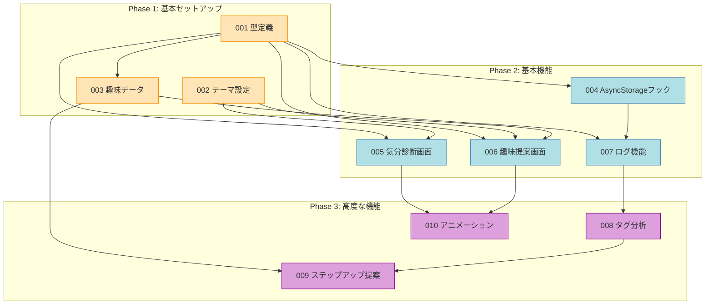

# チケット概要 (Ticket Overview)

## プロジェクト: 趣味のたね (hobby-seeds)

このファイルは全チケットの概要と依存関係を管理します。

---

## チケット一覧

| ID | チケット名 | ステータス | 依存 | 概要 |
|----|-----------|----------|------|------|
| 001 | 型定義の作成 | 🟢 完了 | なし | TypeScript型定義（types/配下） |
| 002 | テーマ設定 | 🟢 完了 | なし | styled-components用テーマ |
| 003 | 趣味データ作成 | 🟢 完了 | 001 | hobbies.json（ゆる趣味51個+ステップアップ42個） |
| 004 | AsyncStorageフック | 🟢 完了 | 001 | useAsyncStorage汎用フック |
| 005 | 気分診断画面 | 🟢 完了 | 001, 002 | 3問の診断フロー |
| 006 | 趣味提案画面 | 🔴 未着手 | 001, 002, 003 | フィルタリング＆表示 |
| 007 | ログ機能 | 🔴 未着手 | 001, 004 | useHobbyLogフック |
| 008 | タグ分析ロジック | 🔴 未着手 | 007 | 傾向分析ユーティリティ |
| 009 | ステップアップ提案 | 🔴 未着手 | 003, 008 | 本格趣味への誘導 |
| 010 | アニメーション | 🔴 未着手 | 005, 006 | UIアニメーション |

---

## ステータス凡例

- 🔴 未着手
- 🟡 作業中
- 🟢 完了
- ⏸️ 保留

---

## 依存関係図

---

## 並行開発ガイド

### 同時着手可能なチケット

**Phase 1（初期）:**
- `001 型定義` と `002 テーマ設定` は並行可能

**Phase 2（001完了後）:**
- `003 趣味データ` と `004 AsyncStorageフック` は並行可能
- `005 気分診断画面` は 001+002 完了後に着手可能

**Phase 3:**
- `008 タグ分析` と `010 アニメーション` は並行可能（依存元が異なる）

### ブロッキング関係

- `006 趣味提案画面` は 001, 002, 003 すべて必要
- `009 ステップアップ提案` は 003, 008 が必要

---

## 開発の進め方

1. 各チケットファイルを開いてTODOを確認
2. 作業開始時にステータスを 🟡 に変更
3. 完了時に各TODO項目をチェック（[x]）
4. 全TODO完了後、ステータスを 🟢 に変更
5. このファイルのチケット一覧も更新

---

*最終更新: 2026年2月1日*
